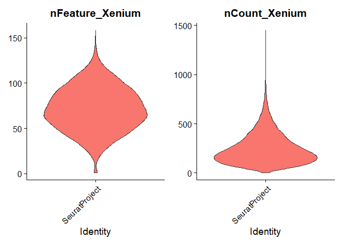
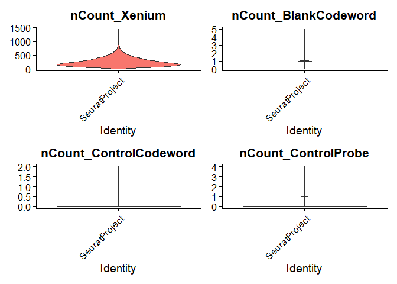
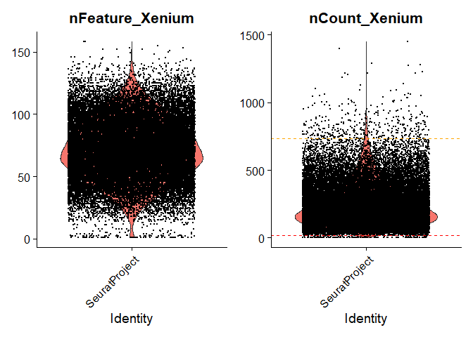
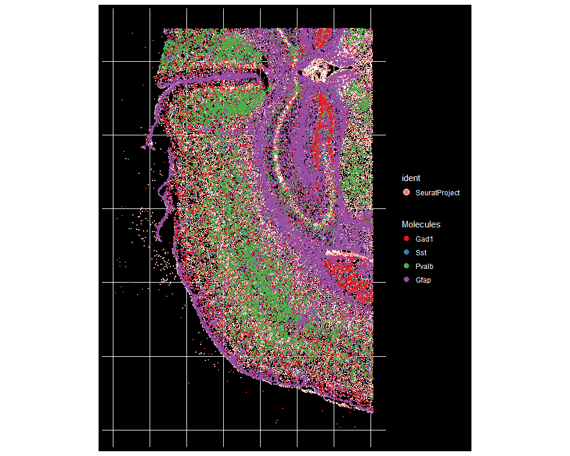
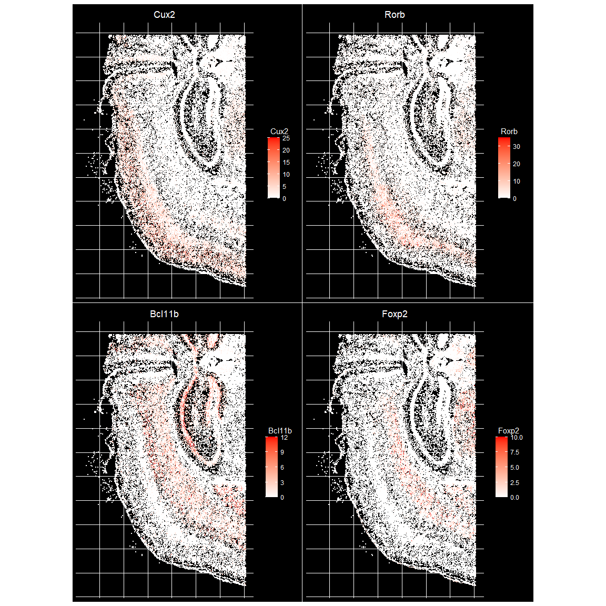
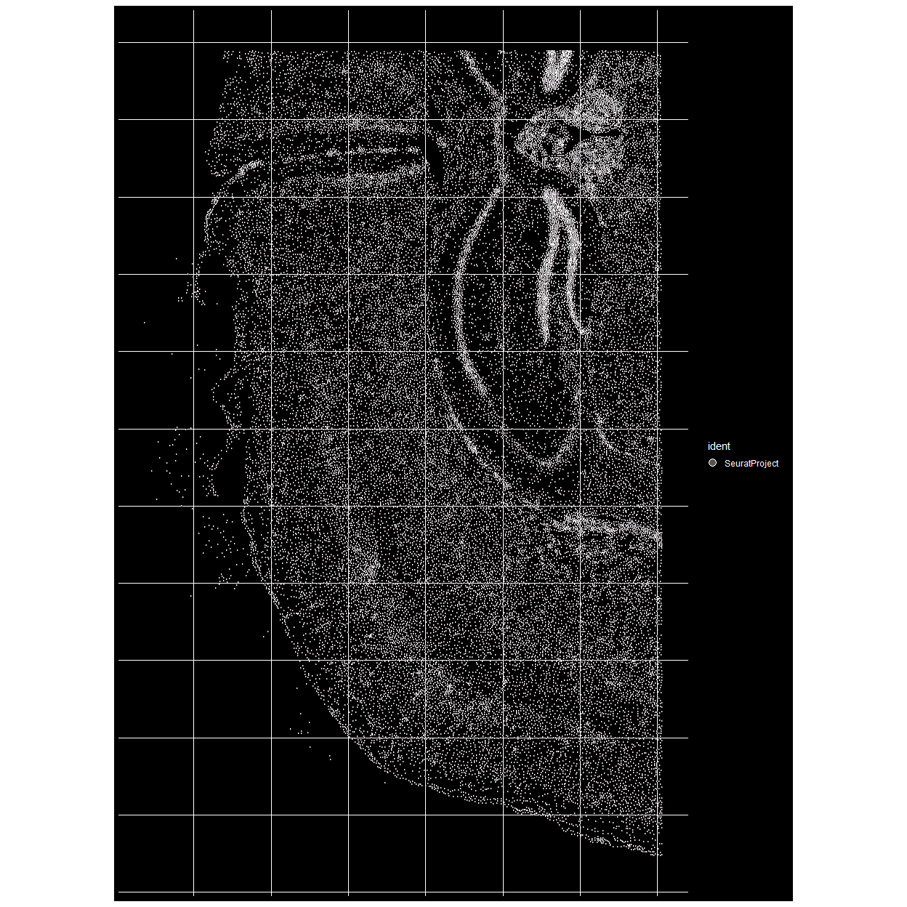

------------------------------------------------------------------------


# Overview

In this vignette, we introduce a Seurat extension to analyze new types of spatially-resolved data. We have [previously introduced a spatial framework](https://satijalab.org/seurat/articles/spatial_vignette.html) which is compatible with sequencing-based technologies, like the 10x Genomics Visium system, or SLIDE-seq. Here, we extend this framework to analyze new data types that are captured via highly multiplexed imaging. In contrast to sequencing-based technologies, these datasets are often targeted (i.e. they profile a pre-selected set of genes). However they can resolve individual molecules - retaining single-cell (and subcellular) resolution. These approaches also often capture cellular boundaries (segmentations).

We update the Seurat infrastructure to enable the analysis, visualization, and exploration of these exciting datasets. In this vignette, we focus on three datasets produced by different multiplexed imaging technologies, each of which is publicly available. We will be adding support for additional imaging-based technologies in the coming months.

-   Vizgen MERSCOPE (Mouse Brain)
-   Nanostring CosMx Spatial Molecular Imager (FFPE Human Lung)
-   Akoya CODEX (Human Lymph Node)

First, we load the packages necessary for this vignette.


``` r
library(Seurat)
library(future)
plan("multisession", workers = 2)
library(ggplot2)
set.seed(2)
```

# Mouse Brain: 10x Genomics Xenium In Situ

In this section we'll analyze data produced by the Xenium platform. The vignette demonstrates how to load the per-transcript location data, cell x gene matrix, cell segmentation, and cell centroid information available in the Xenium outputs. The resulting Seurat object will contain the gene expression profile of each cell, the centroid and boundary of each cell, and the location of each individual detected transcript. The per-cell gene expression profiles are similar to standard single-cell RNA-seq and can be analyzed using the same tools.

This uses the `Tiny subset` dataset from 10x Genomics provided in the [Fresh Frozen Mouse Brain for Xenium Explorer Demo](https://www.10xgenomics.com/resources/datasets/fresh-frozen-mouse-brain-for-xenium-explorer-demo-1-standard) which can be downloaded as described below. These analysis steps are also compatible with the larger `Full coronal section`, but will take longer to execute.


``` bash
# wget https://cf.10xgenomics.com/samples/xenium/1.0.2/Xenium_V1_FF_Mouse_Brain_Coronal_Subset_CTX_HP/Xenium_V1_FF_Mouse_Brain_Coronal_Subset_CTX_HP_outs.zip
# unzip Xenium_V1_FF_Mouse_Brain_Coronal_Subset_CTX_HP_outs.zip
```

First we read in the dataset and create a Seurat object. Provide the path to the data folder for a Xenium run as the input path. The RNA data is stored in the `Xenium` assay of the Seurat object. This step should take about a minute (you can improve this by installing `arrow` and `hdf5r`).


``` r
path <- "Xenium_V1_FF_Mouse_Brain_Coronal_Subset_CTX_HP_outs"

# Load the Xenium data
xenium.obj <- LoadXenium(path, fov = "fov", segmentations = "cell")

# remove cells with 0 counts
xenium.obj <- subset(xenium.obj, subset = nCount_Xenium > 0)
xenium.obj
```

> 36553 samples = 36,553 cells (segments).

> 541 features total across all assays; the active Xenium assay has 248 gene targets (it’s a targeted panel).

> 0 variable features → you haven’t run SCTransform() or FindVariableFeatures() yet.

> Extra assays BlankCodeword / ControlCodeword / ControlProbe are control targets from Xenium for QC (background/negative controls).


xenium.obj
├── assays
│    └── "Xenium"            → counts of each gene per cell
│
├── meta.data               → per-cell metadata (cell area, nCount, etc.)
│
├── reductions              → dimensionality reductions (PCA, UMAP, etc.)
│
├── images (FOVs)           → spatial fields of view (fov, crop, zoom)
│
├── active.assay            → name of currently active assay ("Xenium")
│
└── commands                → log of Seurat processing steps

### 1. Assays


``` r
xenium.obj[["Xenium"]]
```

```
## Assay (v5) data with 248 features for 36553 cells
## First 10 features:
##  2010300C02Rik, Acsbg1, Acta2, Acvrl1, Adamts2, Adamtsl1, Adgrl4,
## Aldh1a2, Angpt1, Ano1 
## Layers:
##  counts
```

| Slot           | Description                                      |
| -------------- | ------------------------------------------------ |
| `counts`       | raw molecule counts (genes × cells)              |
| `data`         | normalized expression (after `SCTransform` etc.) |
| `scale.data`   | scaled data used for PCA                         |
| `var.features` | variable genes selected for modeling             |


``` r
counts <- GetAssayData(xenium.obj, assay = "Xenium", slot = "counts")
dim(counts)  # genes × cells
```

```
## [1]   248 36553
```

> genes × cells.

### 2. Meta data


``` r
head(xenium.obj@meta.data)
```

<div class="kable-table">

|orig.ident    | nCount_Xenium| nFeature_Xenium| nCount_BlankCodeword| nFeature_BlankCodeword| nCount_ControlCodeword| nFeature_ControlCodeword| nCount_ControlProbe| nFeature_ControlProbe|
|:-------------|-------------:|---------------:|--------------------:|----------------------:|----------------------:|------------------------:|-------------------:|---------------------:|
|SeuratProject |           384|              96|                    1|                      1|                      0|                        0|                   0|                     0|
|SeuratProject |           146|              64|                    0|                      0|                      0|                        0|                   0|                     0|
|SeuratProject |            81|              48|                    0|                      0|                      0|                        0|                   0|                     0|
|SeuratProject |           314|              94|                    1|                      1|                      0|                        0|                   0|                     0|
|SeuratProject |           639|              97|                    1|                      1|                      0|                        0|                   0|                     0|
|SeuratProject |           270|              90|                    0|                      0|                      0|                        0|                   0|                     0|

</div>

A data.frame where each row is a cell and each column is a property, e.g.:

| column                               | meaning                                   |
| ------------------------------------ | ----------------------------------------- |
| `nCount_Xenium`                      | total transcript count per cell           |
| `nFeature_Xenium`                    | number of genes detected                  |
| `centroid_x`, `centroid_y`           | centroid coordinates                      |


``` r
xenium.obj$new_metric <- xenium.obj$nCount_Xenium/xenium.obj$nFeature_Xenium
head(xenium.obj@meta.data)
```

<div class="kable-table">

|orig.ident    | nCount_Xenium| nFeature_Xenium| nCount_BlankCodeword| nFeature_BlankCodeword| nCount_ControlCodeword| nFeature_ControlCodeword| nCount_ControlProbe| nFeature_ControlProbe| new_metric|
|:-------------|-------------:|---------------:|--------------------:|----------------------:|----------------------:|------------------------:|-------------------:|---------------------:|----------:|
|SeuratProject |           384|              96|                    1|                      1|                      0|                        0|                   0|                     0|   4.000000|
|SeuratProject |           146|              64|                    0|                      0|                      0|                        0|                   0|                     0|   2.281250|
|SeuratProject |            81|              48|                    0|                      0|                      0|                        0|                   0|                     0|   1.687500|
|SeuratProject |           314|              94|                    1|                      1|                      0|                        0|                   0|                     0|   3.340425|
|SeuratProject |           639|              97|                    1|                      1|                      0|                        0|                   0|                     0|   6.587629|
|SeuratProject |           270|              90|                    0|                      0|                      0|                        0|                   0|                     0|   3.000000|

</div>

``` r
colnames(xenium.obj@meta.data)
```

```
##  [1] "orig.ident"               "nCount_Xenium"           
##  [3] "nFeature_Xenium"          "nCount_BlankCodeword"    
##  [5] "nFeature_BlankCodeword"   "nCount_ControlCodeword"  
##  [7] "nFeature_ControlCodeword" "nCount_ControlProbe"     
##  [9] "nFeature_ControlProbe"    "new_metric"
```


``` r
# List available FOVs
Images(xenium.obj)
```

```
## [1] "fov"
```

``` r
# Access the main field of view
fov_data <- xenium.obj[["fov"]]
fov_data
```

```
## Spatial coordinates for 36553 cells and 541 molecules
##  First 10 molecules: 2010300C02Rik, Acsbg1, Acta2, Acvrl1, Adamts2, Adamtsl1
## Default segmentation boundary: centroids 
##  1 other segmentation boundaries present: segmentations 
## Associated assay: Xenium 
## Key: Xenium_
```


``` r
centroids <- GetTissueCoordinates(fov_data, which = "centroids")
head(centroids)
```

<div class="kable-table">

|        x|        y|cell |
|--------:|--------:|:----|
| 1898.815| 2540.963|1    |
| 1895.305| 2532.627|2    |
| 2368.073| 2534.409|3    |
| 1903.726| 2560.010|4    |
| 1917.481| 2543.132|5    |
| 1926.540| 2560.044|6    |

</div>


``` r
centroids <- GetTissueCoordinates(xenium.obj[["fov"]], which = "centroids")
colnames(centroids) <- c("centroid_x", "centroid_y")

# Add to meta.data
xenium.obj@meta.data <- cbind(xenium.obj@meta.data, centroids[Cells(xenium.obj), ])
head(xenium.obj@meta.data[, c("centroid_x", "centroid_y")])
```

<div class="kable-table">

| centroid_x| centroid_y|
|----------:|----------:|
|   1898.815|   2540.963|
|   1895.305|   2532.627|
|   2368.073|   2534.409|
|   1903.726|   2560.010|
|   1917.481|   2543.132|
|   1926.540|   2560.044|

</div>

### 3. Images (spatial fields of view)


``` r
xenium.obj@images
```

```
## $fov
## Spatial coordinates for 36553 cells and 541 molecules
##  First 10 molecules: 2010300C02Rik, Acsbg1, Acta2, Acvrl1, Adamts2, Adamtsl1
## Default segmentation boundary: centroids 
##  1 other segmentation boundaries present: segmentations 
## Associated assay: Xenium 
## Key: Xenium_
```

## 🧭 Typical navigation cheatsheet

| What you want        | Command                                                          |
| -------------------- | ---------------------------------------------------------------- |
| List assays          | `Assays(xenium_obj)`                                             |
| Active assay         | `DefaultAssay(xenium_obj)`                                       |
| Get counts           | `GetAssayData(xenium_obj, slot = "counts")`                      |
| Get normalized data  | `GetAssayData(xenium_obj, slot = "data")`                        |
| Metadata table       | `xenium_obj@meta.data`                                           |
| Feature (gene) names | `rownames(xenium_obj)`                                           |
| Cell (barcode) names | `colnames(xenium_obj)`                                           |
| Image names          | `Images(xenium_obj)`                                             |
| Inspect one image    | `xenium_obj[["fov"]]`                                            |
| Centroid coordinates | `GetTissueCoordinates(xenium_obj[["fov"]], which = "centroids")` |


🧠 Conceptually

The assay holds expression (how much of each gene).

The images hold location (where each cell/molecule is).

The metadata links those (what each cell is or belongs to).

The reductions summarize global patterns (clusters, UMAP).

Together, they make Seurat powerful for spatial + molecular integration.


Spatial information is loaded into slots of the Seurat object, labelled by the name of "field of view" (FOV) being loaded. Initially all the data is loaded into the FOV named `fov`. Later, we will make a cropped FOV that zooms into a region of interest.

Standard QC plots provided by Seurat are available via the `Xenium` assay. Here are violin plots of genes per cell (`nFeature_Xenium`) and transcript counts per cell (`nCount_Xenium`)


``` r
VlnPlot(xenium.obj, features = c("nFeature_Xenium", "nCount_Xenium"), ncol = 2, pt.size = 0)
```

<!-- -->


``` r
VlnPlot(xenium.obj, features = c("nCount_Xenium", "nCount_BlankCodeword", "nCount_ControlCodeword",
    "nCount_ControlProbe"), ncol = 2, pt.size = 0)
```

<!-- -->


> What the two violins mean

* nFeature_Xenium = number of detected genes per cell (how many targets were seen at least once).

* nCount_Xenium = total transcripts/UMIs per cell (sequencing/imaging depth per cell).

Each violin shows the distribution across cells (or across identities if you’ve set Idents(xenium.obj)). Wide parts = many cells at that value; long tails = a few extreme cells.


``` r
library(ggplot2)

# Example data-driven cutoffs (tweak these!)
min_feats <- quantile(xenium.obj$nFeature_Xenium, 0.01, na.rm = TRUE)
max_counts <- quantile(xenium.obj$nCount_Xenium, 0.99, na.rm = TRUE)

p <- VlnPlot(xenium.obj, features = c("nFeature_Xenium", "nCount_Xenium"), ncol = 2, pt.size = 0.1  # show a few points
) + geom_hline(yintercept = min_feats, linetype = "dashed", colour = "red") +
    geom_hline(yintercept = max_counts, linetype = "dashed", colour = "orange")

p
```

<!-- -->


``` r
xenium.obj[["Xenium"]]
```

```
## Assay (v5) data with 248 features for 36553 cells
## First 10 features:
##  2010300C02Rik, Acsbg1, Acta2, Acvrl1, Adamts2, Adamtsl1, Adgrl4,
## Aldh1a2, Angpt1, Ano1 
## Layers:
##  counts
```


``` r
rownames(xenium.obj)
```

```
##   [1] "2010300C02Rik" "Acsbg1"        "Acta2"         "Acvrl1"       
##   [5] "Adamts2"       "Adamtsl1"      "Adgrl4"        "Aldh1a2"      
##   [9] "Angpt1"        "Ano1"          "Aqp4"          "Arc"          
##  [13] "Arhgap12"      "Arhgap25"      "Arhgap6"       "Arhgef28"     
##  [17] "Bcl11b"        "Bdnf"          "Bhlhe22"       "Bhlhe40"      
##  [21] "Btbd11"        "Cabp7"         "Cacna2d2"      "Calb1"        
##  [25] "Calb2"         "Car4"          "Carmn"         "Cbln1"        
##  [29] "Cbln4"         "Ccn2"          "Cd24a"         "Cd300c2"      
##  [33] "Cd44"          "Cd53"          "Cd68"          "Cd93"         
##  [37] "Cdh13"         "Cdh20"         "Cdh4"          "Cdh6"         
##  [41] "Cdh9"          "Chat"          "Chodl"         "Chrm2"        
##  [45] "Cldn5"         "Clmn"          "Cntn6"         "Cntnap4"      
##  [49] "Cntnap5b"      "Cobll1"        "Col19a1"       "Col1a1"       
##  [53] "Col6a1"        "Cort"          "Cplx3"         "Cpne4"        
##  [57] "Cpne6"         "Cpne8"         "Crh"           "Cspg4"        
##  [61] "Cux2"          "Cwh43"         "Cyp1b1"        "Dcn"          
##  [65] "Deptor"        "Dkk3"          "Dner"          "Dpy19l1"      
##  [69] "Dpyd"          "Ebf3"          "Emcn"          "Epha4"        
##  [73] "Eya4"          "Fezf2"         "Fgd5"          "Fhod3"        
##  [77] "Fibcd1"        "Fign"          "Fmod"          "Fn1"          
##  [81] "Fos"           "Foxp2"         "Gad1"          "Gad2"         
##  [85] "Gadd45a"       "Galnt14"       "Garnl3"        "Gfap"         
##  [89] "Gfra2"         "Gjb2"          "Gjc3"          "Gli3"         
##  [93] "Gm19410"       "Gm2115"        "Gng12"         "Gpr17"        
##  [97] "Grik3"         "Gsg1l"         "Gucy1a1"       "Hapln1"       
## [101] "Hat1"          "Hpcal1"        "Hs3st2"        "Htr1f"        
## [105] "Id2"           "Igf1"          "Igf2"          "Igfbp4"       
## [109] "Igfbp5"        "Igfbp6"        "Igsf21"        "Ikzf1"        
## [113] "Inpp4b"        "Kcnh5"         "Kcnmb2"        "Kctd12"       
## [117] "Kctd8"         "Kdr"           "Lamp5"         "Laptm5"       
## [121] "Ly6a"          "Lypd6"         "Lyz2"          "Mapk4"        
## [125] "Mdga1"         "Mecom"         "Meis2"         "Myl4"         
## [129] "Myo16"         "Ndst3"         "Ndst4"         "Necab1"       
## [133] "Necab2"        "Nell1"         "Neto2"         "Neurod6"      
## [137] "Nostrin"       "Npnt"          "Npy2r"         "Nr2f2"        
## [141] "Nrep"          "Nrn1"          "Nrp2"          "Nts"          
## [145] "Ntsr2"         "Nwd2"          "Nxph3"         "Opalin"       
## [149] "Opn3"          "Orai2"         "Paqr5"         "Parm1"        
## [153] "Pcsk5"         "Pde11a"        "Pde7b"         "Pdgfra"       
## [157] "Pdyn"          "Pdzd2"         "Pdzrn3"        "Pecam1"       
## [161] "Penk"          "Pglyrp1"       "Pip5k1b"       "Pkib"         
## [165] "Plch1"         "Plcxd2"        "Plcxd3"        "Plekha2"      
## [169] "Pln"           "Pou3f1"        "Ppp1r1b"       "Prdm8"        
## [173] "Prox1"         "Prph"          "Prr16"         "Prss35"       
## [177] "Pthlh"         "Pvalb"         "Rab3b"         "Rasgrf2"      
## [181] "Rasl10a"       "Rbp4"          "Rfx4"          "Rims3"        
## [185] "Rmst"          "Rnf152"        "Ror1"          "Rorb"         
## [189] "Rprm"          "Rspo1"         "Rspo2"         "Rxfp1"        
## [193] "Satb2"         "Sdk2"          "Sema3a"        "Sema3d"       
## [197] "Sema3e"        "Sema5b"        "Sema6a"        "Shisa6"       
## [201] "Siglech"       "Sipa1l3"       "Sla"           "Slc13a4"      
## [205] "Slc17a6"       "Slc17a7"       "Slc39a12"      "Slc44a5"      
## [209] "Slc6a3"        "Slfn5"         "Slit2"         "Sncg"         
## [213] "Sntb1"         "Sorcs3"        "Sox10"         "Sox11"        
## [217] "Sox17"         "Spag16"        "Spi1"          "Spp1"         
## [221] "Sst"           "Stard5"        "Strip2"        "Syndig1"      
## [225] "Syt17"         "Syt2"          "Syt6"          "Tacr1"        
## [229] "Tanc1"         "Th"            "Thsd7a"        "Tle4"         
## [233] "Tmem132d"      "Tmem163"       "Tmem255a"      "Tox"          
## [237] "Trbc2"         "Trem2"         "Trp73"         "Trpc4"        
## [241] "Unc13c"        "Vat1l"         "Vip"           "Vwc2l"        
## [245] "Wfs1"          "Zfp366"        "Zfp536"        "Zfpm2"
```


Next, we plot the positions of the pan-inhibitory neuron marker Gad1, inhibitory neuron sub-type markers Pvalb, and Sst, and astrocyte marker Gfap on the tissue using `ImageDimPlot()`.


``` r
ImageDimPlot(xenium.obj, fov = "fov", molecules = c("Gad1", "Sst", "Pvalb", "Gfap"), nmols = 20000)
```

<!-- -->


Here we visualize the expression level of some key layer marker genes at the per-cell level using `ImageFeaturePlot()` which is analogous to the `FeaturePlot()` function for visualizing expression on a 2D embedding. We manually adjust the `max.cutoff` for each gene to roughly the 90th percentile (which can be specified with `max.cutoff='q90'`) of it's count distribution to improve contrast.


``` r
ImageFeaturePlot(xenium.obj, features = c("Cux2", "Rorb", "Bcl11b", "Foxp2"), max.cutoff = c(25,
    35, 12, 10), size = 0.75, cols = c("white", "red"))
```

<!-- -->

We can zoom in on a chosen area with the `Crop()` function. Once zoomed-in, we can visualize cell segmentation boundaries along with individual molecules.


``` r
# allow up to 4 GB for globals shipped to workers
old_opts <- options(future.globals.maxSize = 4 * 1024^3)  # bytes
on.exit(options(old_opts), add = TRUE)


cropped.coords <- Crop(xenium.obj[["fov"]], x = c(1200, 2900), y = c(3750, 4550), coords = "plot")
```

```
## Error in getGlobalsAndPackages(expr, envir = envir, globals = globals): The total size of the 9 globals exported for future expression ('FUN()') is 540.60 MiB. This exceeds the maximum allowed size 500.00 MiB per by R option "future.globals.maxSize". This limit is set to protect against transfering too large objects to parallel workers by mistake, which may not be intended and could be costly. See help("future.globals.maxSize", package = "future") for further explainations and how to adjust or remove this threshold The three largest globals are 'FUN' (360.31 MiB of class 'function'), 'x' (180.14 MiB of class 'list') and 'over' (141.31 KiB of class 'function')
```

``` r
xenium.obj[["zoom"]] <- cropped.coords
```

```
## Error: object 'cropped.coords' not found
```

``` r
# visualize cropped area with cell segmentations & selected molecules
DefaultBoundary(xenium.obj[["zoom"]]) <- "segmentation"
```

```
## Error in `` `*tmp*`[["zoom"]] ``:
## ! 'zoom' not found in this Seurat object
## 
```

``` r
ImageDimPlot(xenium.obj, fov = "zoom", axes = TRUE, border.color = "white", border.size = 0.1, cols = "polychrome",
    coord.fixed = FALSE, molecules = c("Gad1", "Sst", "Npy2r", "Pvalb", "Nrn1"), nmols = 10000)
```

```
## Error in ImageDimPlot(xenium.obj, fov = "zoom", axes = TRUE, border.color = "white", : No compatible spatial coordinates present
```

Next, we use SCTransform for normalization followed by standard dimensionality reduction and clustering. This step takes about 5 minutes from start to finish.

### 1) SCTransform(xenium.obj, assay = "Xenium")


``` r
# 1) Normalize & model with SCTransform on the Xenium assay
xenium.obj <- SCTransform(xenium.obj, assay = "Xenium")
```

```
## Error in getGlobalsAndPackages(expr, envir = envir, globals = globals): The total size of the 14 globals exported for future expression ('FUN()') is 918.80 MiB. This exceeds the maximum allowed size 500.00 MiB per by R option "future.globals.maxSize". This limit is set to protect against transfering too large objects to parallel workers by mistake, which may not be intended and could be costly. See help("future.globals.maxSize", package = "future") for further explainations and how to adjust or remove this threshold The three largest globals are 'FUN' (848.72 MiB of class 'function'), 'object' (69.61 MiB of class 'numeric') and 'split.cells' (453.29 KiB of class 'list')
```

What it does:

*Normalizes counts using a regularized negative binomial model (removes depth effects), identifies variable features, and stores transformed data.

*You don’t need NormalizeData() or ScaleData() afterwards—SCTransform() replaces them.

Where it goes:

*By default, it creates an assay named "SCT" (derived from your input assay "Xenium"), sets DefaultAssay(xenium.obj) <- "SCT", and stores:

*SCT@counts (copied or corrected counts),

*SCT@data (Pearson-residual-like normalized values),

*SCT@scale.data (residuals used for PCA),

variable genes in VariableFeatures(xenium.obj).

> Tip: check with Assays(xenium.obj) and DefaultAssay(xenium.obj) right after.


``` r
# sanity checks
Assays(xenium.obj)  # expect 'Xenium' and new 'SCT'
```

```
## [1] "Xenium"          "BlankCodeword"   "ControlCodeword" "ControlProbe"
```

``` r
DefaultAssay(xenium.obj)  # expect 'SCT'
```

```
## [1] "Xenium"
```

``` r
length(VariableFeatures(xenium.obj))
```

```
## [1] 0
```

### 2) RunPCA(xenium.obj, npcs = 30, features = rownames(xenium.obj))


``` r
# 2) PCA
xenium.obj <- RunPCA(xenium.obj, npcs = 30, features = rownames(xenium.obj))
```

```
## Error in `PrepDR5()`:
## ! No layer matching pattern 'scale.data' not found. Please run ScaleData and retry
```


What it does:

*Computes PCA on the (SCT) data.

*features = rownames(xenium.obj) means “use all features of the default assay.” Since SCTransform set the default to SCT, you’re using all SCT features (not just variable ones).

Where it goes:

*Saves a reduction called "pca" in xenium.obj@reductions$pca.

*Loadings and embeddings available via Loadings(xenium.obj, "pca") and Embeddings(xenium.obj, "pca").

> Tip: Usually you’d use only variable features: features = VariableFeatures(xenium.obj) for single cell data. Using all features on a targeted panel is often fine for xenium.


``` r
Loadings(xenium.obj, "pca")
```

```
## Error in `object[[reduction]]`:
## ! 'pca' not found in this Seurat object
## 
```

``` r
Embeddings(xenium.obj, "pca")
```

```
## Error in `object[[reduction]]`:
## ! 'pca' not found in this Seurat object
## 
```


### 3) RunUMAP(xenium.obj, dims = 1:30)


``` r
# 3) UMAP (tune per ElbowPlot)
xenium.obj <- RunUMAP(xenium.obj, dims = 1:30)
```

```
## Error in `object[[reduction]]`:
## ! 'pca' not found in this Seurat object
## 
```

What it does:

Runs UMAP on the PCA embeddings for PCs 1–30 (the default reduction = "pca").

UMAP is stochastic; set a seed for reproducibility.

Where it goes:

Saves a reduction called "umap" in xenium.obj@reductions$umap.

Coordinates via Embeddings(xenium.obj, "umap").

> Tip: choose the number of PCs with an elbow plot or variance explained, not always “30”.


``` r
# quick diagnostic: how many PCs are useful?
ElbowPlot(xenium.obj, ndims = 30)
```

```
## Error in `object[[reduction]]`:
## ! 'pca' not found in this Seurat object
## 
```


### 4) FindNeighbors(xenium.obj, reduction = "pca", dims = 1:30)


``` r
# 4) Neighbours
xenium.obj <- FindNeighbors(xenium.obj, reduction = "pca", dims = 1:30)
```

```
## Error in `object[[reduction]]`:
## ! 'pca' not found in this Seurat object
## 
```


What it does:

Builds a kNN graph in PCA space (default k = 20).

Computes shared-nearest-neighbour (SNN) graph used by clustering.

Where it goes:

Stores graphs in xenium.obj@graphs, typically names like SCT_nn and SCT_snn (prefix from default assay).


### 5) FindClusters(xenium.obj, resolution = 0.3)


``` r
# 5) Clusters
xenium.obj <- FindClusters(xenium.obj, resolution = 0.3)
```

```
## Error in FindClusters.Seurat(xenium.obj, resolution = 0.3): Provided graph.name not present in Seurat object
```

What it does:

Community detection (Louvain/Leiden) on the SNN graph to assign cluster IDs.

Where it goes:

Sets Idents(xenium.obj) to cluster labels and adds a seurat_clusters column in xenium.obj@meta.data.

> Tip: resolution controls cluster granularity. Try a small grid (e.g., 0.2–1.0) and compare.

We can then visualize the results of the clustering by coloring each cell according to its cluster either in UMAP space with `DimPlot()` or overlaid on the image with `ImageDimPlot()`.


``` r
DimPlot(xenium.obj)
```

```
## Error in `DefaultDimReduc()`:
## ! Unable to find a DimReduc matching one of 'umap', 'tsne', or 'pca'; please specify a dimensional reduction to use
```

We can visualize the expression level of the markers we looked at earlier on the UMAP coordinates.


``` r
FeaturePlot(xenium.obj, features = c("Cux2", "Bcl11b", "Foxp2", "Gad1", "Sst", "Gfap"))
```

```
## Error in `DefaultDimReduc()`:
## ! Unable to find a DimReduc matching one of 'umap', 'tsne', or 'pca'; please specify a dimensional reduction to use
```

We can now use `ImageDimPlot()` to color the cell positions colored by the cluster labels determined in the previous step.


``` r
ImageDimPlot(xenium.obj, cols = "polychrome", size = 0.75)
```

<!-- -->


<details>

<summary>**Session Info**</summary>


``` r
sessionInfo()
```

```
## R version 4.5.1 (2025-06-13 ucrt)
## Platform: x86_64-w64-mingw32/x64
## Running under: Windows 11 x64 (build 26100)
## 
## Matrix products: default
##   LAPACK version 3.12.1
## 
## locale:
## [1] LC_COLLATE=English_United Kingdom.utf8 
## [2] LC_CTYPE=English_United Kingdom.utf8   
## [3] LC_MONETARY=English_United Kingdom.utf8
## [4] LC_NUMERIC=C                           
## [5] LC_TIME=English_United Kingdom.utf8    
## 
## time zone: Europe/London
## tzcode source: internal
## 
## attached base packages:
## [1] stats     graphics  grDevices utils     datasets  methods   base     
## 
## other attached packages:
## [1] ggplot2_4.0.0      future_1.67.0      Seurat_5.3.0       SeuratObject_5.2.0
## [5] sp_2.2-0          
## 
## loaded via a namespace (and not attached):
##   [1] RColorBrewer_1.1-3     rstudioapi_0.17.1      jsonlite_2.0.0        
##   [4] magrittr_2.0.4         spatstat.utils_3.2-0   ggbeeswarm_0.7.2      
##   [7] farver_2.1.2           rmarkdown_2.30         ragg_1.5.0            
##  [10] vctrs_0.6.5            ROCR_1.0-11            spatstat.explore_3.5-3
##  [13] htmltools_0.5.8.1      sass_0.4.10            sctransform_0.4.2     
##  [16] parallelly_1.45.1      KernSmooth_2.23-26     bslib_0.9.0           
##  [19] htmlwidgets_1.6.4      ica_1.0-3              plyr_1.8.9            
##  [22] plotly_4.11.0          zoo_1.8-14             cachem_1.1.0          
##  [25] igraph_2.2.1           mime_0.13              lifecycle_1.0.4       
##  [28] pkgconfig_2.0.3        Matrix_1.7-4           R6_2.6.1              
##  [31] fastmap_1.2.0          fitdistrplus_1.2-4     shiny_1.11.1          
##  [34] digest_0.6.37          patchwork_1.3.2        tensor_1.5.1          
##  [37] RSpectra_0.16-2        irlba_2.3.5.1          textshaping_1.0.4     
##  [40] labeling_0.4.3         progressr_0.18.0       spatstat.sparse_3.1-0 
##  [43] httr_1.4.7             polyclip_1.10-7        abind_1.4-8           
##  [46] compiler_4.5.1         proxy_0.4-27           bit64_4.6.0-1         
##  [49] withr_3.0.2            S7_0.2.0               DBI_1.2.3             
##  [52] fastDummies_1.7.5      R.utils_2.13.0         MASS_7.3-65           
##  [55] classInt_0.4-11        units_1.0-0            tools_4.5.1           
##  [58] vipor_0.4.7            lmtest_0.9-40          otel_0.2.0            
##  [61] beeswarm_0.4.0         httpuv_1.6.16          future.apply_1.20.0   
##  [64] goftest_1.2-3          R.oo_1.27.1            glue_1.8.0            
##  [67] nlme_3.1-168           promises_1.5.0         sf_1.0-21             
##  [70] grid_4.5.1             Rtsne_0.17             cluster_2.1.8.1       
##  [73] reshape2_1.4.4         generics_0.1.4         hdf5r_1.3.12          
##  [76] gtable_0.3.6           spatstat.data_3.1-9    tzdb_0.5.0            
##  [79] class_7.3-23           R.methodsS3_1.8.2      tidyr_1.3.1           
##  [82] data.table_1.17.8      spatstat.geom_3.6-0    RcppAnnoy_0.0.22      
##  [85] ggrepel_0.9.6          RANN_2.6.2             pillar_1.11.1         
##  [88] stringr_1.6.0          spam_2.11-1            RcppHNSW_0.6.0        
##  [91] later_1.4.4            splines_4.5.1          dplyr_1.1.4           
##  [94] lattice_0.22-7         survival_3.8-3         bit_4.6.0             
##  [97] deldir_2.0-4           tidyselect_1.2.1       miniUI_0.1.2          
## [100] pbapply_1.7-4          knitr_1.50             gridExtra_2.3         
## [103] scattermore_1.2        xfun_0.53              matrixStats_1.5.0     
## [106] stringi_1.8.7          lazyeval_0.2.2         yaml_2.3.10           
## [109] evaluate_1.0.5         codetools_0.2-20       tibble_3.3.0          
## [112] cli_3.6.5              uwot_0.2.3             systemfonts_1.3.1     
## [115] arrow_21.0.0.1         xtable_1.8-4           reticulate_1.44.0     
## [118] jquerylib_0.1.4        Rcpp_1.1.0             globals_0.18.0        
## [121] spatstat.random_3.4-2  png_0.1-8              ggrastr_1.0.2         
## [124] spatstat.univar_3.1-4  parallel_4.5.1         assertthat_0.2.1      
## [127] dotCall64_1.2          listenv_0.10.0         viridisLite_0.4.2     
## [130] e1071_1.7-16           scales_1.4.0           ggridges_0.5.7        
## [133] purrr_1.1.0            rlang_1.1.6            cowplot_1.2.0         
## [136] formatR_1.14
```

</details>


